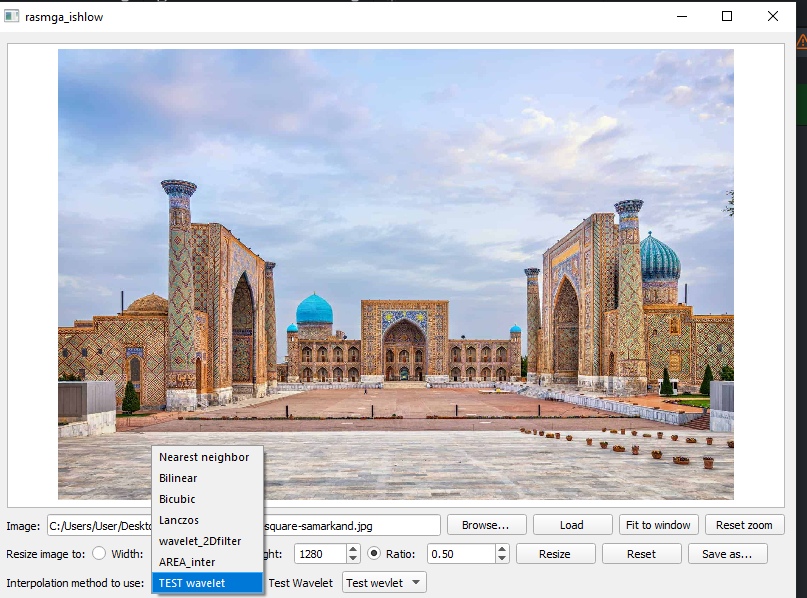

# ImageResizer
Tool capable of resizing images using the nearest neighbor, bilinear interpolation,inter area, wavelet and bicubic interpolation algorithmsusing opencv. Written in Qt/C++.

## Download
Download link: [Win32 binary](https://github.com/botir2/RasimGa_ishlov.git)

## Screenshots

### Input

### Resized using bilinear interpolation

### Resized using bicubic interpolation
Note the higher quality of the output image.  

